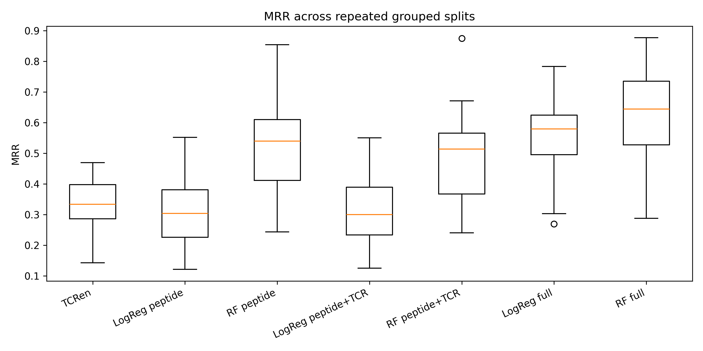
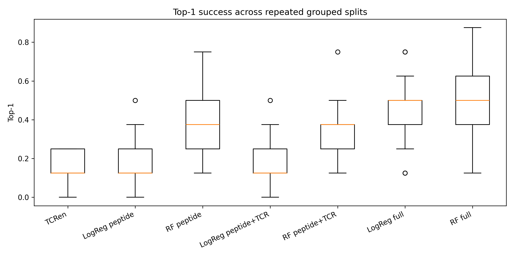
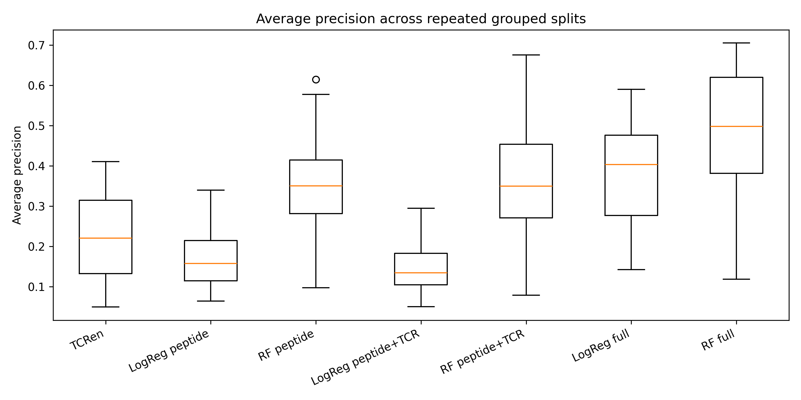
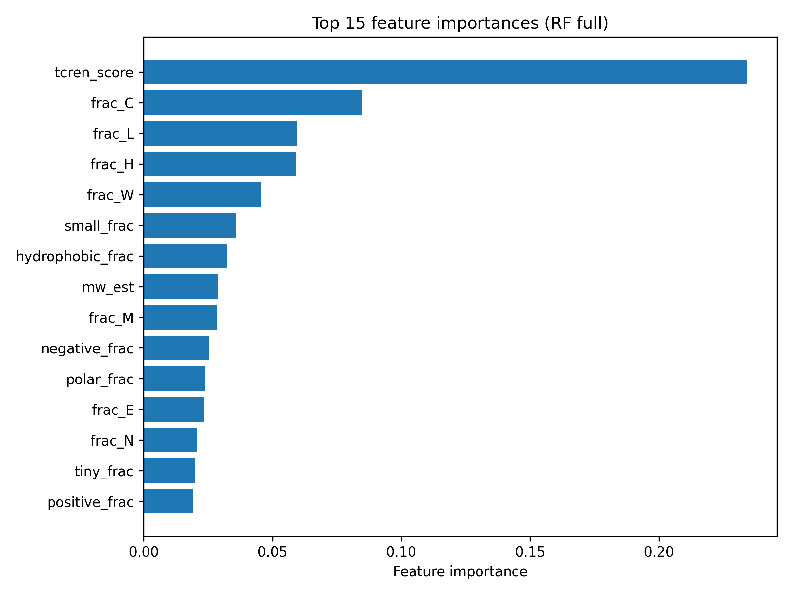

# TCR–Peptide Ranking with Sequence Features and TCRen

[](https://github.com/annemcq/tcr-peptide-ranking/actions/workflows/tests.yml)

This project ranks a collection of candidate peptides against a given T cell receptor (TCR) by use of a tailor-made machine learning pipeline. The dataset includes TCR CDR3 features, sequence-derived peptide features, as well as structure-based TCRen score, subsequently evaluated across 30 train/test splits.

**Main finding:** Combining and contrasting different methodologies reveals that the best ranking performance is achieved by a hybrid Random Forest using all three signals taken together (peptide features, TCR features and TCRen), rather than selecting just one. This work shows that TCRen on its own provides a weaker baseline than peptide features do. However, using the combination of both yields complementary information for this purpose.  

| Model | MRR | Top-1 | Top-5 | Avg. precision | ROC-AUC |
|---|---|---|---|---|---|
| TCRen baseline | 0.33 | 0.15 | 0.49 | 0.22 | 0.91 |
| LogReg peptide | 0.30 | 0.16 | 0.47 | 0.17 | 0.88 |
| LogReg peptide+TCR | 0.30 | 0.16 | 0.46 | 0.15 | 0.87 |
| RF peptide+TCR | 0.48 | 0.35 | 0.63 | 0.35 | 0.88 |
| RF peptide | 0.51 | 0.38 | 0.67 | 0.35 | 0.89 |
| LogReg full | 0.56 | 0.45 | 0.70 | 0.37 | 0.94 |
| **RF full (best)** | **0.62** | **0.50** | **0.77** | **0.49** | **0.93** |

*All values are means across 30 repeated grouped train/test splits. See `results/repeated_eval_summary_with_tcr.csv` for standard deviations and additional metrics.*

Additionally, I performed a paired statistical significance test between all 7 models on MRR (Wilcoxon signed-rank, Holm-Bonferroni corrected across the 21 pairwise comparisons — see `results/paired_significance_mrr.csv`). Notably, the superior performance of RF full is statistically significant against all other models **except** for LogReg full (p ≈ 0.10, not significant after correction). Therefore, the statement "Random Forest full model performs the best" holds decisively against peptide-only and TCR-agnostic baselines, whilst the difference between RF and logistic regression when it comes to the full models  (peptide+TCR+TCRen) cannot be distinguished at the current sample size (30 repeats).

---

## Background

The TCRen score, introduced by [Karnaukhov et al. (2024)](https://doi.org/10.1038/s43588-024-00653-0), is a structure-based statistical potential that scores TCR–peptide pairs from their predicted contact map. It is shown to perform well as a standalone ranking method, which does not however include sequence-derived features.

The aim of the current project is to address a simple question: **can simple engineered sequence features complement the TCRen score in the peptide ranking task?** To address it, I constructed a pipeline which compares Karnaukhov's statistical potential against a series of models and hybrid combinations of the three, namely peptide-feature models and TCR-feature models.

---

## Project structure

```
.
├── data/                # raw input files from the TCRen paper repo
├── processed/           # intermediate CSVs produced by the pipeline
├── results/              # evaluation metrics (CSV)
├── plots/                # generated figures
├── models/               # final trained model + feature columns (for inference)
├── notebooks/
│   ├── tcr_peptide_ranking_showcase.ipynb
│   └── inference_showcase.ipynb
├── src/
│   ├── build_dataset.py
│   ├── compute_tcren_scores.py
│   ├── add_peptide_features.py
│   ├── add_tcr_features.py
│   ├── run_evaluation.py
│   ├── feature_importance.py
│   ├── plot_results.py
│   ├── paired_significance_test.py
│   └── sequence_features.py
├── tests/
│   └── test_features.py
├── requirements.txt
├── pytest.ini
├── .gitignore
└── README.md
```

---

## How to reproduce

```bash
git clone <repo-url>
cd tcr-peptide-ranking
pip install -r requirements.txt

# Run the full pipeline in order
python src/build_dataset.py
python src/compute_tcren_scores.py
python src/add_peptide_features.py
python src/add_tcr_features.py
python src/run_evaluation.py
python src/feature_importance.py
python src/plot_results.py

# Paired statistical significance testing between the 7 models
python src/paired_significance_test.py

# Run the tests
pytest tests/
```

The notebook `notebooks/tcr_peptide_ranking_showcase.ipynb` gives a concise overview of the main results. `notebooks/inference_showcase.ipynb` shows the model applied to genuinely new input — including a held-out demo (see below).

**Requirements:** Python ≥ 3.10, plus the libraries listed in `requirements.txt` (pandas, numpy, scikit-learn, scipy, matplotlib, jupyter, joblib, pytest).

---

## Data

Input files are derived from the repository accompanying:

> Karnaukhov VK, Shcherbinin DS, Chugunov AO, et al. **Structure-based prediction of T cell receptor recognition of unseen epitopes using TCRen.** *Nature Computational Science* (2024). [doi:10.1038/s43588-024-00653-0](https://doi.org/10.1038/s43588-024-00653-0)

The three files used are stored in `data/`:

- `summary_PDB_structures.csv` — TCR system metadata, including cognate peptide and CDR3α/β sequences
- `contact_maps_PDB.csv` — residue–residue contacts for each TCR–peptide complex
- `TCRen_potential.csv` — the TCRen statistical potential lookup table

---

## Pipeline

### 1. Dataset construction (`build_dataset.py`)

For each of 25 TCR systems with available contact maps, I construct a candidate set of:

- 1 cognate (positive) peptide
- 100 random negative peptides of the same length

This produces 2,525 TCR–peptide pairs.

### 2. TCRen scoring (`compute_tcren_scores.py`)

The contact map of the cognate TCR-peptide is reused for every candidate peptide, where peptide residues are replaced on a position-by-position basis. The final TCRen score is a sum of the statistical potential over all TCR-peptide contacts.

### 3. Peptide features (`add_peptide_features.py`)

For each peptide, the following features are computed:

- Length
- Fraction of hydrophobic, polar, positively charged, negatively charged, aromatic, small, and tiny residues
- Glycine and proline fractions
- Estimated molecular weight
- Per-residue amino acid composition (20 features)

### 4. TCR features (`add_tcr_features.py`)

From the CDR3α and CDR3β sequences:

- CDR3 length (α and β)
- Fraction of hydrophobic, positively charged, negatively charged, and aromatic residues (α and β)
- Glycine and proline fractions (α and β)

### 5. Evaluation (`run_evaluation.py`)

Seven models are compared:

| Model | Features used |
|---|---|
| `tcren_baseline` | TCRen score only |
| `logreg_peptide` | Logistic regression, peptide features |
| `rf_peptide` | Random forest, peptide features |
| `logreg_peptide_tcr` | Logistic regression, peptide + TCR |
| `rf_peptide_tcr` | Random forest, peptide + TCR |
| `logreg_full` | Logistic regression, peptide + TCR + TCRen |
| `rf_full` | Random forest, peptide + TCR + TCRen |

**Splitting strategy:** train/test splits are done by `pdb_id` using `GroupShuffleSplit`. All candidate peptides for a given TCR stay in the same split, so the model is always tested on unseen TCRs. This avoids leakage that would occur with random row-level splits.

**Evaluation protocol:** 30 repeated grouped splits (test size 30%). For each split and each model, I report ROC-AUC, average precision, accuracy, mean rank, median rank, MRR, top-1, and top-5.

### 6. Paired statistical significance testing (`paired_significance_test.py`)

For this part, a paired test was employed in place of an unpaired one, since all 7 models are evaluated on the same held-out test set within each repeat, which makes their per-repeat MRR values paired observations rather than independent samples. Specifically, I ran all 21 pairwise comparisons using a Wilcoxon signed-rank test (primary, distribution-free), cross-checked with a paired t-test, and applied Holm-Bonferroni correction across the 21 comparisons. Full results in `results/paired_significance_mrr.csv`.

### 7. Inference on new input (`inference_showcase.ipynb`)

This inference section calls for additional considerations; `rf_full` needs the TCRen score, which in turn requires an existing solved structure — not readily available for a genuinely new candidate peptide. So for the inference task, I use `rf_peptide_tcr` instead (peptide + TCR sequence features only, no structure required), accepting the real, statistically-confirmed accuracy trade-off that comes with it.

To validate this without leakage, I held out one whole TCR system (1AO7, the well-known A6/Tax TCR-pMHC complex) from training entirely, trained on the remaining 24 systems, and ranked 1AO7's own 101 candidates (1 true peptide + 100 decoys) as if the model had never seen this TCR before: **the true cognate peptide ranked #1 of 101.**

---

## Results

### Ranking performance

The full Random Forest model achieves the best performance on every ranking metric.







Some important patterns emerge across all metrics:

1. **Peptide-only Random Forest models outperform the TCRen baseline.** Simple engineered peptide features contain useful ranking signal on their own.
2. **Adding TCR features improves Random Forest performance further.** Explicit TCR information contributes value beyond peptide composition alone.
3. **The combined model is best.** TCRen is most useful as part of a hybrid model rather than as a standalone predictor.

Moreover, Random Forest performs better than Logistic regression across the board, indicating non-linear interactions between features are relevant for this task.

### Feature importance



`tcren_score` is the most important feature as expected. The next two — cysteine fraction (`frac_C`) and histidine fraction (`frac_H`) — deserve scrutiny.

> **Caveat: top sequence features likely reflect a negative-generation artifact, not real biology.**
>
> It is important to consider that each residue appears at ~5% frequency, given that negatives are drawn uniformly from all 20 amino acids. Notably, cysteine and histidine occur at substantially lower frequencies in natural peptides, and particularly in MHC-presented epitopes, where cysteine is seen to be disfavoured. Thus, the classifier may partly separate positives from negatives by detecting an excess of these two residues, instead of by learning the underlying recognition determinants. 
>
> Some of the observed gain from such feature-based models likely originates from this distribution gap, rather than capturing genuine TCR–peptide biology. This leaves the generation of biologically realistic negatives (e.g., proteome-sampled peptides of the matching length, or peptides with preserved MHC anchor residues) as the following step of importance for this work.

This serves as a reminder that although the model is right, it could be due to the wrong reasons.

---

## Limitations

This is a small prototype study, not a benchmark. The main limitations are:

- **Sample size.** Only 25 TCR systems are used.
- **Negative generation.** Negatives are uniform random peptides rather than biologically filtered candidates. The feature importance analysis above suggests the model partly exploits this.
- **No structural remodeling.** Candidate peptides reuse the original complex's contact map rather than being re-modeled, which may bias TCRen scores for distant candidates.
- **Simple TCR representations.** CDR3 features are hand-engineered summaries (length, composition) rather than learned sequence embeddings.
- **One evaluation protocol.** Only `GroupShuffleSplit` is used; cross-validation with `GroupKFold` would provide a complementary check.
- **The inference demo is illustrative, not a validation.** The genuinely held-out result (1AO7 ranked #1 of 101) is one concrete example, not a generalization claim — the small hand-picked candidate list in the second part of `inference_showcase.ipynb` includes real, unrelated epitopes as a weak sanity check only.

---

## Possible next steps

- **Realistic negatives.** Sample negatives from real proteomes (e.g., human Swiss-Prot) at the matching length, or generate them while preserving MHC anchor residues.
- **More TCR systems.** Scale beyond 25 systems as additional structures become available.
- **Richer TCR features.** Replace hand-engineered CDR3 summaries with k-mer counts or learned embeddings (ESM, ProtBERT, or TCR-specific models like TCRBert).
- **Additional evaluation.** Add `GroupKFold` cross-validation; bootstrap confidence intervals on the final metrics.
- **Compare against published baselines.** Once negatives are realistic, compare against ERGO, NetTCR, or pMTnet on a shared benchmark.

---

## Reference

Karnaukhov VK, Shcherbinin DS, Chugunov AO, Karnaukhova MO, Guryanova OA, Chudakov DM, Bagaev DV, Zvyagin IV, Shugay M, Efremov RG. **Structure-based prediction of T cell receptor recognition of unseen epitopes using TCRen.** *Nature Computational Science* (2024). [doi:10.1038/s43588-024-00653-0](https://doi.org/10.1038/s43588-024-00653-0)

---

## License

MIT — see `LICENSE`.
